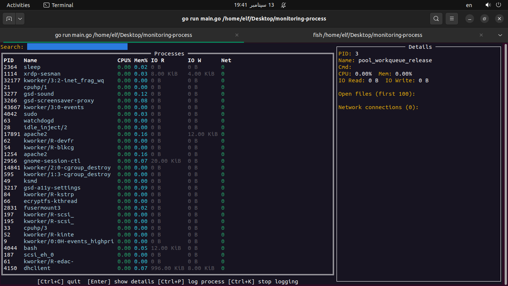
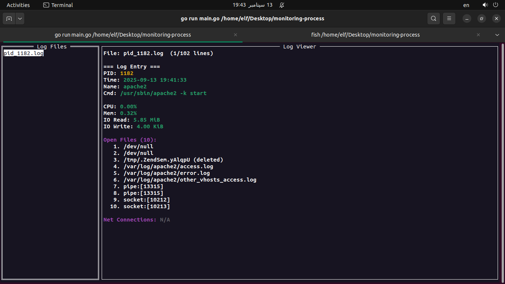

# 🖥️ Process Monitor & Logger

A **terminal-based process monitoring and logging tool** written in Go. This program lets you:

- 📊 **Monitor live processes** with CPU, memory, I/O, open files, and network connections.
- 📝 **Log specific processes** to JSON files every second.
- 🔍 **Browse previously saved logs** in a built-in log viewer.

All of this is rendered beautifully in the terminal with an interactive **TUI (text user interface)** powered by [tview](https://github.com/rivo/tview).

---

## ✨ Features

- **Live Monitoring Mode**
  - View all processes sorted by CPU usage.
  - See CPU %, Memory %, I/O usage, open files, and network connections.
  - Interactive search and selection.

- **Per-Process Logging**
  - Save process activity to `.log` files as structured JSON.
  - Logs include CPU, memory, I/O stats, open files, and network connections.
  - Logs update every second.

- **Log Viewer Mode**
  - Open a folder with `.log` files.
  - Navigate logs interactively.
  - Pretty-printed with syntax coloring.

---

## 🚀 Installation

```bash
# Clone the repository
git clone https://github.com/6-E-L-F-6/process-monitoring/
cd process-monitoring/

# Build the binary
go build -o procmon

# Run it
./procmon
```

> Requires **Go 1.20+** and **Linux (with /proc access)**.

---

## 🎮 Usage

When you start the app, you’ll see a menu:

- **Monitoring Mode** → Start live process monitoring.
- **Log Viewer Mode** → Open saved logs.
- **Quit** → Exit the application.

### Monitoring Mode

- `Ctrl+C` → Quit
- `Enter` → Lock details on a process
- `Esc` → Unlock process
- `Ctrl+P` → Start logging selected process
- `Ctrl+K` → Stop logging

### Log Viewer Mode

- `← / →` → Navigate between log entries
- `↑ / ↓` → Switch between log files
- `Esc` → Exit viewer

---

## 📷 Screenshots

### 🔹 Monitoring Mode


### 🔹 Log Viewer Mode


---

## 📂 Log Format

Logs are stored in **JSON Lines** (`.log`) format. Example entry:

```json
{
  "time": "2025-09-12 14:23:01",
  "pid": 1234,
  "name": "nginx",
  "cmd": "/usr/sbin/nginx -g daemon off;",
  "cpu": 1.23,
  "mem": 0.45,
  "io_read": 10240,
  "io_write": 2048,
  "open_files": ["/etc/nginx/nginx.conf", "/var/log/nginx/access.log"],
  "net_conns": [
    {
      "proto": "tcp",
      "localip": "127.0.0.1",
      "localport": "8080",
      "remip": "192.168.1.50",
      "remport": "52345",
      "state": "ESTABLISHED",
      "inode": "123456"
    }
  ]
}
```

---

## 🛠️ Tech Stack

- [Go](https://go.dev/) – Core language
- [tview](https://github.com/rivo/tview) – TUI components
- [gopsutil](https://github.com/shirou/gopsutil) – Process/system info

---

## 🤝 Contributing

Pull requests are welcome! If you’d like to add features or fix bugs:

1. Fork the project.
2. Create a feature branch (`git checkout -b feature-xyz`).
3. Commit changes (`git commit -m 'Add xyz'`).
4. Push to the branch (`git push origin feature-xyz`).
5. Open a Pull Request.

---

## 💖 Support & Contact

If you find this project useful and want to support further development:

- 💬 Contact me on Telegram: [@E6L6F6](https://t.me/E6L6F6)

## 📜 License

MIT License © 2025 [ELF]

